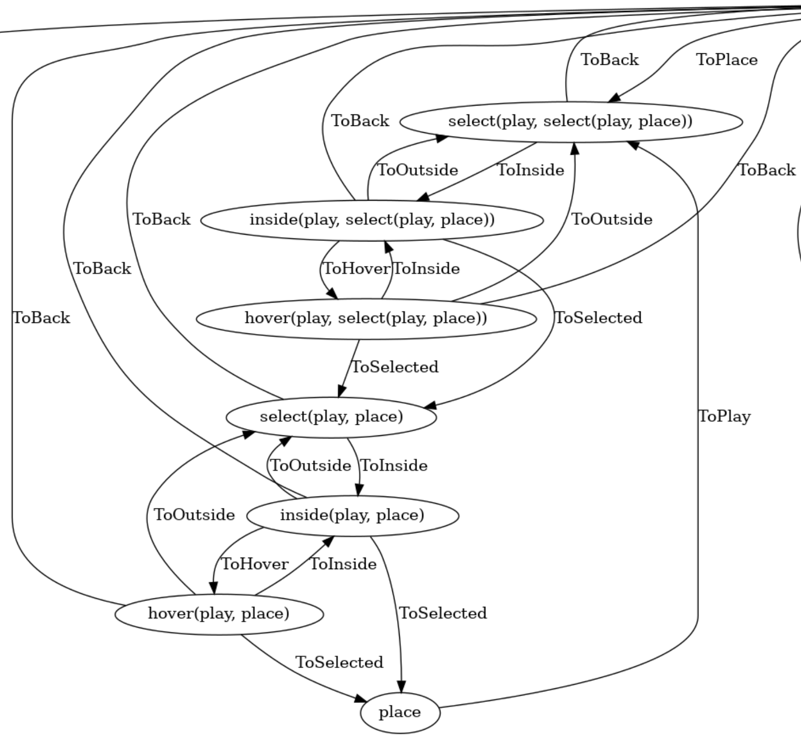

Polystate: Composable Finite State Machines

# Building and using in an existing project
Download and add polystate as a dependency by running the following command in your project root:
```shell
zig fetch --save git+https://github.com/sdzx-1/polystate.git
```

Then add polystate as a dependency and import its modules and artifact in your build.zig:

```zig
    const polystate = b.dependency("polystate", .{
        .target = target,
        .optimize = optimize,
    });

```

Now add the modules to your module as you would normally:

```zig
    exe_mod.addImport("polystate", typed_fsm.module("root"));
```

# Examples

[polystate-examples](https://github.com/sdzx-1/polystate-examples)

[ray-game](https://github.com/sdzx-1/ray-game)

# Discord

https://discord.gg/zUK2Zk9m

# How to use polystate?

Writing this document was more difficult than I anticipated. Although I have been writing and using this library for a while, it's not easy to explain it clearly to others. If you have any questions after reading this document, please don't hesitate to ask. I'd be happy to clear up any confusion!

## Polystate's Core Design Philosophy
1.  Record the state machine's status at the type level.
2.  Achieve composable state machines through type composition.

Finite State Machines (FSMs) are a powerful programming pattern. When combined with composability and type safety, they become an even more ideal programming paradigm.

The `polystate` library is designed precisely for this purpose. To achieve this, you need to follow a few simple programming conventions. These conventions are very straightforward, and the benefits they bring are entirely worth it.

## Practical Effects of Polystate
1.  **Define the program's overall behavior through compositional declarations.** This means we gain the ability to specify the program's overall behavior at the type level. This significantly improves the correctness of imperative program structures. This programming style also encourages us to redesign the program's state from the perspective of types and composition, thereby enhancing code composability.
2.  **Build complex state machines by composing simple states.** For the first time, we can achieve semantic-level code reuse through type composition. In other words, we have found a way to express semantic-level code reuse at the type level. This approach achieves three effects simultaneously: conciseness, correctness, and safety.
3.  **Automatically generate state diagrams.** Since the program's overall behavior is determined by declarations, `polystate` can automatically generate state diagrams. Users can intuitively understand the program's overall behavior through these diagrams.

I believe all of this represents a great step forward for imperative programming!

## Detailed Explanation of Design Philosophy and Practical Effects

Let's start with a concrete example of a simple state machine. I will explain the core design philosophy of this library in detail through comments in the code.

```zig
const std = @import("std");
const polystate = @import("polystate");

pub fn main() !void {
    var st: GST = .{};
    /// Determine an initial state
    const wa = Example.Wit(Example.a){};
    /// Start executing the state machine with the message handler of this initial state
    /// The reason for using handler_normal here is related to tail-call optimization, which I will explain in detail later.
    wa.handler_normal(&st);
}

pub const GST = struct {
    counter_a: i64 = 0,
    counter_b: i64 = 0,
};

/// `polystate` has two core state types: FST (FSM Type) and GST (Global State Type).
/// FST must be an enum type. In this example, the FST is `Example`, which defines all the states of our state machine. In other words, it defines the set of states we will track at the type level.
/// GST is the global data. In this example, the GST is defined above with two fields, `counter_a` and `counter_b`, representing the data needed for state `a` and state `b`, respectively.
/// When we compose states, what we really want is to compose state handler functions, which implies a requirement for global data.
/// Therefore, the first programming convention is: the handler function for any state has access to the GST (i.e., global data), but users should try to use only the data corresponding to the current state.
/// For example, in the handler function for state `a`, you should try to use only the data `counter_a`.
/// This can be easily achieved through some naming conventions, and it's easy to create corresponding generic functions through metaprogramming, but the specific implementation is outside the scope of `polystate`.
const Example = enum {
    /// Three concrete states are defined here
    exit,
    a,
    b,

    /// `Wit` is a core concept in `polystate`, short for Witness. The term comes from [Haskell](https://serokell.io/blog/haskell-type-level-witness), where it's called a 'type witness' or 'runtime evidence'.
    /// The core concepts of a finite state machine include four parts: state, message, message handler function, and message generator function. I will detail these parts in the example below.
    /// The purpose of the `Wit` function is to specify the state information contained in a message.
    pub fn Wit(val: anytype) type {
        return polystate.Witness(@This(), GST, null, polystate.val_to_sdzx(@This(), val));
    }

    /// This is the second programming convention: The FST needs a public declaration that contains the specific content of the state. By adding `ST` after the state name, we implicitly associate the state with its specific content.
    /// In this example, this corresponds to the public declarations below:
    /// exit ~ exitST
    /// a    ~ aST
    /// b    ~ bST
    /// Here, `exitST` describes the four parts for the `exit` state: state, message, message handler function, and message generator function.
    /// Since the `exit` state has no messages, it also has no message generator function.
    /// This is the third programming convention: The implementation of a state's specific content must contain a function: `pub fn handler(*GST) void` or `pub fn conthandler(*GST) ContR`.
    /// They represent the message handler function. The former means the state machine has full control of the control flow. The latter means a continuation function is returned, leaving the external caller to invoke the continuation function and take control of the flow.
    pub const exitST = union(enum) {
        pub fn handler(ist: *GST) void {
            std.debug.print("exit\n", .{});
            std.debug.print("st: {any}\n", .{ist.*});
        }
    };
    pub const aST = a_st;
    pub const bST = b_st;
};

/// This describes the four parts for state `a`: state, message, message handler function, and message generator function.
/// 1. State
/// The state here is `a`.
pub const a_st = union(enum) {
    /// 2. Message
    /// A tagged union is used here to describe the messages, and `Wit` is used to describe the state we are about to transition to.
    AddOneThenToB: Example.Wit(Example.b),
    Exit: Example.Wit(Example.exit),

    /// 3. Message Handler Function
    /// Handles all messages generated by `genMsg`.
    pub fn handler(ist: *GST) void {
        switch (genMsg(ist)) {
            .AddOneThenToB => |wit| {
                ist.counter_a += 1;
                /// This is the fourth programming convention: At the end of the message handling block, you must call `wit.handler(ist)` or similar code.
                /// This indicates that the message handler function of the new state will be executed. The new state is controlled by the `Wit` function of the message.
                wit.handler(ist);
            },
            .Exit => |wit| wit.handler(ist),
        }
    }

    /// 4. Message Generator Function
    /// If the value of `counter_a` is greater than 3, return `.Exit`.
    /// Otherwise, return `.AddOneThenToB`.
    /// The messages generated and handled here are defined in part 2 above.
    fn genMsg(ist: *GST) @This() {
        if (ist.counter_a > 3) return .Exit;
        return .AddOneThenToB;
    }
};

pub const b_st = union(enum) {
    AddOneThenToA: Example.Wit(Example.a),

    pub fn handler(ist: *GST) void {
        switch (genMsg()) {
            .AddOneThenToA => |wit| {
                ist.counter_b += 1;
                wit.handler(ist);
            },
        }
    }

    fn genMsg() @This() {
        return .AddOneThenToA;
    }
};

```
The above is a simple example showing how to build a simple state machine with `polystate`.
This example does not demonstrate `polystate`'s most powerful feature: **composability**.

## Explaining Composability
Let me modify the above example by adding a new state, `yes_or_no`, to demonstrate composability.
I will omit some of the code that is identical to the above. The complete code for this example can be found [here](https://github.com/sdzx-1/polystate-examples/blob/main/src/exe-counter.zig).

```zig
const std = @import("std");
const polystate = @import("polystate");

pub fn main() !void {
   ...
}

pub const GST = struct {
  ...
  buf: [10] u8 = @splat(0),
};

///Example
const Example = enum {
    exit,
    a,
    b,
    /// A new state `yes_or_no` is defined here
    yes_or_no,


    pub fn Wit(val: anytype) type {
        ...
    }

    pub const exitST = union(enum) {
      ...
    };
    pub const aST = a_st;
    pub const bST = b_st;
    
    /// The specific implementation of the new state is a function that depends on two state parameters: `yes` and `no`.
    /// Its semantic is to provide an interactive choice for the user: if the user chooses 'yes', it transitions to the state corresponding to `yes`; if the user chooses 'no', it transitions to the state corresponding to `no`.
    /// The `sdzx` function here turns a regular enum type into a new, composable type.
    /// For example, I can use `polystate.sdzx(Example).C(.yes_or_no, &.{ .a, .b })` to represent the state `(yes_or_no, a, b)`.
    /// I usually write this type as `yes_or_no(a, b)`, which indicates that `yes_or_no` is a special state that requires two concrete state parameters.
    /// Semantically, `yes_or_no(exit, a)` means: user confirmation is required before exiting. If the user chooses 'yes', it will transition to the `exit` state; if the user chooses 'no', it will transition to the `a` state.
    /// Similarly, `yes_or_no(yes_or_no(exit, a), a)` means: user confirmation is required twice before exiting. The user must choose 'yes' both times to exit.
    /// This is what composability means. Please make sure you understand this.
    pub fn yes_or_noST(yes: polystate.sdzx(@This()), no: polystate.sdzx(@This())) type {
        return yes_or_no_st(@This(), yes, no, GST);
    }
};

pub const a_st = union(enum) {
    AddOneThenToB: Example.Wit(Example.b),
    /// This shows how to build and use a composite message in code.
    /// For a composite message, it needs to be placed in a tuple. The first state is the function, and the rest are its state parameters.
    /// Here, `.{ Example.yes_or_no, Example.exit, Example.a }` represents the state: `yes_or_no(exit, a)`.
    Exit: Example.Wit(.{ Example.yes_or_no, Example.exit, Example.a }),
    /// Similarly, `.{ Example.yes_or_no, .{Example.yes_or_no, Example.exit, Example.a}, Example.a }` can be used to represent the state: `yes_or_no(yes_or_no(exit, a), a)`.
    ...
};

pub const b_st = union(enum) {
  ...
};

/// Specific implementation of the `yes_or_no` state.
/// First, it's a function that takes four parameters: `FST`, `GST1`, `yes`, and `no`. Note that its implementation is independent of `Example` itself.
/// This is a generic implementation, independent of any specific state machine. You can use this code in any state machine.
/// I will explain this code again from four aspects: state, message, message handler function, and message generator function.
pub fn yes_or_no_st(
    FST: type,
    GST1: type,
    yes: polystate.sdzx(FST),
    no: polystate.sdzx(FST),
) type {
    /// 1. State
    /// Its specific state is: `polystate.sdzx(FST).C(FST.yes_or_no, &.{ yes, no })`.
    /// It requires two parameters, `yes` and `no`, and also needs to ensure that `FST` definitely has a `yes_or_no` state.
    return union(enum) {
        /// 2. Message
        /// There are three messages here. Special attention should be paid to `Retry`, which represents the semantic of re-entering due to an input error.
        Yes: Wit(yes),
        No: Wit(no),
        /// Note the state being constructed here; it points to itself.
        Retry: Wit(polystate.sdzx(FST).C(FST.yes_or_no, &.{ yes, no })),

        fn Wit(val: polystate.sdzx(FST)) type {
            return polystate.Witness(FST, GST1, null, val);
        }

        /// 3. Message Handler Function
        pub fn handler(gst: *GST1) void {
            switch (genMsg(gst)) {
                .Yes => |wit| wit.handler(gst),
                .No => |wit| wit.handler(gst),
                .Retry => |wit| wit.handler(gst),
            }
        }

        const stdIn = std.io.getStdIn().reader();
        
        /// 4. Message Generator Function
        /// Reads a string from `stdIn`. If the string is "y", it returns the message `.Yes`. If the string is "n", it returns the message `.No`.
        /// In other cases, it returns `.Retry`.
        fn genMsg(gst: *GST) @This() {
            std.debug.print(
                \\Yes Or No:
                \\y={}, n={}
                \\
            ,
                .{ yes, no },
            );

            const st = stdIn.readUntilDelimiter(&gst.buf, '\n') catch |err| {
                std.debug.print("Input error: {any}, retry\n", .{err});
                return .Retry;
            };

            if (std.mem.eql(u8, st, "y")) {
                return .Yes;
            } else if (std.mem.eql(u8, st, "n")) {
                return .No;
            } else {
                std.debug.print("Error input: {s}\n", .{st});
                return .Retry;
            }
        }
    };
}
```
This example clearly demonstrates how to achieve a composable state machine through type composition.

## Polystate in Practice

### 1. [Combining `checkPin` to Express Complex Logic](https://github.com/sdzx-1/polystate-examples/blob/main/src/exe-atm.zig)

Imagine an ATM. When we are in the `checkPin` state, the user is required to enter a PIN from an external source. If the PIN is correct, it sends a `Successed` message and transitions to the state specified by the `success` parameter. If it's incorrect, it sends a `Failed` message and transitions to the state specified by the `failed` parameter.

A common requirement is: the user can try to enter the PIN a maximum of three times. If all three attempts fail, the card should be ejected, and the machine should return to the initial screen.

"A maximum of three times" here is an extremely important security requirement that should not be easily changed.

By composing states, we can naturally implement this effect. We design `checkPin` as a generic state, and then in the declaration of state transitions, we precisely describe this business logic by composing `checkPin`.

```zig
  pub fn checkPinST(success: polystate.sdzx(Atm), failed: polystate.sdzx(Atm)) type {
        return union(enum) {
            Successed: polystate.Witness(Atm, GST, null, success),
            Failed: polystate.Witness(Atm, GST, null, failed),

            ...
            ...
        }
  }

    pub const readyST = union(enum) {
        /// By nesting the declaration of `checkPin` three times, we ensure that the PIN check happens at most three times. This precisely describes the behavior we need.
        /// This demonstrates how to determine the program's overall behavior through compositional declarations.
        InsertCard: Wit(.{ Atm.checkPin, Atm.session, .{ Atm.checkPin, Atm.session, .{ Atm.checkPin, Atm.session, Atm.ready } } }),
        Exit: Wit(.{ Atm.are_you_sure, Atm.exit, Atm.ready }),

        ...
    }

```
We can directly see its overall logic through the state diagram, and [`polystate` can automatically generate all of this](https://github.com/sdzx-1/polystate-examples/blob/fecaffb5b7f5eba09c9428c18f1cd97e7ee09e71/src/exe-atm.zig#L19).


### 2. [Implementing and Reusing Selection Semantics](https://github.com/sdzx-1/ray-game/blob/master/src/select.zig)

I used `raylib` to implement a generic "selection" semantic: interactive selection via the mouse.

The specific behavior of selection is composed of three generic states (`select`, `inside`, `hover`) and their associated messages.

These states and messages implement: selecting an element with the mouse and how to respond when the mouse hovers over it.
```zig

pub fn selectST(
    FST: type,
    GST: type,
    enter_fn: ?fn (polystate.sdzx(FST), *GST) void,
    back: polystate.sdzx(FST),
    selected: polystate.sdzx(FST),
) type {
    const cst = polystate.sdzx_to_cst(FST, selected);
    const SDZX = polystate.sdzx(FST);

    return union(enum) {
        // zig fmt: off
        ToBack  : polystate.Witness(FST, GST, enter_fn, back),
        ToInside: polystate.Witness(FST, GST, enter_fn, SDZX.C(FST.inside, &.{ back, selected })),
        // zig fmt: on
       ...
    };
}

pub fn insideST(
    FST: type,
    GST: type,
    enter_fn: ?fn (polystate.sdzx(FST), *GST) void,
    back: polystate.sdzx(FST),
    selected: polystate.sdzx(FST),
) type {
    const cst = polystate.sdzx_to_cst(FST, selected);
    const SDZX = polystate.sdzx(FST);

    return union(enum) {
        // zig fmt: off
        ToBack    : polystate.Witness(FST, GST, enter_fn, back),
        ToOutside : polystate.Witness(FST, GST, enter_fn, SDZX.C(FST.select, &.{ back, selected })),
        ToHover   : polystate.Witness(FST, GST, enter_fn, SDZX.C(FST.hover, &.{ back, selected })),
        ToSelected: polystate.Witness(FST, GST, enter_fn, selected),
        // zig fmt: on
       ...
    };
}

pub fn hoverST(
    FST: type,
    GST: type,
    enter_fn: ?fn (polystate.sdzx(FST), *GST) void,
    back: polystate.sdzx(FST),
    selected: polystate.sdzx(FST),
) type {
    const cst = polystate.sdzx_to_cst(FST, selected);
    const SDZX = polystate.sdzx(FST);

    return union(enum) {
        // zig fmt: off
        ToBack    : polystate.Witness(FST, GST, enter_fn, back),
        ToOutside : polystate.Witness(FST, GST, enter_fn, SDZX.C(FST.select, &.{ back, selected })),
        ToInside  : polystate.Witness(FST, GST, enter_fn, SDZX.C(FST.inside, &.{ back, selected })),
        ToSelected: polystate.Witness(FST, GST, enter_fn, selected),
        // zig fmt: on

       ...
    };
}

```

In the [`ray-game`](https://github.com/sdzx-1/ray-game) project, the "selection" semantic was reused at least eight times, which greatly reduced code and improved correctness.

An interesting example in this project is "two-stage selection": you first need to select a building, then select a grid location to place it. The choice of building also constrains the choice of location. 

Such semantics can be concisely expressed as:
```zig
pub const placeST = union(enum) {
    ToPlay: Wit(.{ Example.select, Example.play, .{ Example.select, Example.play, Example.place } }),
    ...
};

```
This code describes our intent with extreme conciseness. But if you look at the state diagram, you will find that the actual state transitions it corresponds to are quite complex.



Through simple declarations, we have nestedly reused complex "selection" semantics. This is a huge victory!

[The complete code for all of this is right here](https://github.com/sdzx-1/ray-game/blob/587f1698cb717c393c3680060a057ac8b02d89c2/src/play.zig#L33), in about 130 lines of code. 
