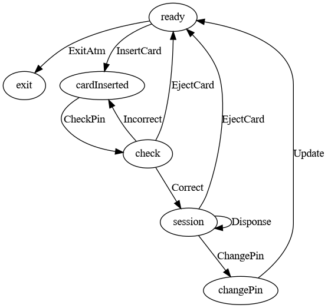

# Run demo
You can run the demo with the following command:

# Demo atm-gui
```shell
zig build -Dexamples atm-gui
```

default pin: 1234

# Building and using
## In an existing project
Download and add type-fsm-zig as a dependency by running the following command in your project root:
```shell
zig fetch --save git+https://github.com/sdzx-1/typed-fsm-zig.git
```

Then add typed-fsm-zig as a dependency and import its modules and artifact in your build.zig:

```zig
    const typed_fsm = b.dependency("typed_fsm", .{
        .target = target,
        .optimize = optimize,
    });

```

Now add the modules to your module as you would normally:

```zig
    exe_mod.addImport("typed_fsm", typed_fsm.module("root"));
```

# 1. Briefly introduce the advantages of typed finite state machines
## 1.1 Introduction to finite state machines
Finite state machines (FSM, hereinafter referred to as state machines) are a very common design pattern in programs.

It contains two main concepts: state and message. The overall behavior of a state machine program is to continuously generate and process messages.

The state mainly helps people understand the generation and processing of messages at the code level.

## 1.2 Introduction to the advantages of typed-fsm-zig

Using zig's powerful type system and some programming specifications, we can implement type-safe finite state machines in zig.

It has the following two advantages:
### 1. Type safety greatly facilitates code writing, modification and refactoring
Handwritten state machines have a great mental burden in actual code, and it is even more difficult to modify and refactor them.

typed-fsm-zig tracks the changes of state machines in terms of types, so that the definition, generation, and processing of messages are all associated with states, so that the type system can help us check whether there are state errors in this process.

When writing, modifying and refactoring, any state error will generate a compilation error, and these compilation errors can help us find and solve problems quickly.

ps: It is recommended to check when opening in zls, so that you can almost get an interactive state machine development environment.

### 2. Simple and efficient, no code generation, easy to integrate with existing logic

typed-fsm-zig is a programming idea, and you can use it conveniently if you master this idea.

In actual use, there is no code generation, and there is no other control except for an implicit constraint requirement. Developers fully control the state machine, so you can easily combine it with your existing code.

# 2. Example: Modify the state of the ATM state machine
Here I will use an ATM state machine (hereinafter referred to as ATM) as an example to show how typed-fsm-zig and zig's type system can help me quickly modify the state of the ATM.

For simplicity, I will not show the process of building the ATM example here. If you are interested, you can see the [code](https://github.com/sdzx-1/typed-fsm-zig/blob/master/examples/atm-gui.zig) here.

## 2.1 Introduction to ATM state machine
ATM stands for automatic teller machine, so the logic of its code is to simulate some behaviors of an automatic teller machine: insert bank card, enter PIN, check PIN, withdraw money, and modify PIN.

Its overall state machine is as follows:



In the figure, the oval represents the state, and the arrow represents the message.
It contains five states: exit, ready, cardInserted, session, changePin.

At the same time, it also contains a bunch of messages, each of which contains the transformation of the system state.
For example, the message InsertCard represents the transformation of the ATM state from ready to cardInserted, which means that the user inserts the card.

The message Incorrect represents the transformation of the ATM state from cardInserted to cardInserted,
which represents a loop, indicating that the user entered the wrong pin, but can try to enter the pin again. Of course, we require a maximum of three attempts.

The whole program effect is as follows:


Note the Update message here, which represents updating the pin and changes the state from changePin to ready.


The actual performance is that we modify the pin in the changePin interface, then click the Change button to trigger the Update message, modify the pin, and return to the ready interface.


In the next article I will modify the behavior of Update and show how the type system helps me quickly adjust the code in the process.

## 2.2 Modify the Update message
The actual message Update definition code is as follows
```zig
    pub fn changePinMsg(end: AtmSt) type {
        return union(enum) {
            Update: struct { v: [4]u8, wit: WitFn(end, .ready) = .{} },
            ...
        }
  }

```

Here, .ready means that the state will be ready after the Update message is processed.

We modify this and change it to .cardInserted, which means that we require that the new pin be entered into the cardInserted interface after the pin is updated, which seems to be a reasonable requirement.

The new state diagram is as follows:


If I recompile the code at this point, the type system will generate the following error:

```shell

➜  typed-fsm-zig git:(doc) ✗ zig build atm-gui
atm-gui
└─ run atm-gui
   └─ zig build-exe atm-gui Debug native 1 errors
examples/atm-gui.zig:301:60: error: expected type 'typed-fsm.Witness(atm-gui.AtmSt,.exit,.ready)', found 'typed-fsm.Witness(atm-gui.AtmSt,.exit,.cardInserted)'
                    @call(.always_tail, readyHandler, .{ val.wit, ist });
                                                        ~~~^~~~
src/typed-fsm.zig:9:20: note: struct declared here (2 times)
            return struct {
                   ^~~~~~
examples/atm-gui.zig:254:46: note: parameter type declared here
pub fn readyHandler(comptime w: AtmSt.EWitness(.ready), ist: *InternalState) void {
                               ~~~~~~~~~~~~~~^~~~~~~~
referenced by:
    cardInsertedHander__anon_6916: examples/atm-gui.zig:271:13
    readyHander__anon_3925: examples/atm-gui.zig:261:13
    5 reference(s) hidden; use '-freference-trace=7' to see all references

```
It tells us that there is a type mismatch in line 301. Because the previous state was ready, readyHandler is used.

When we change the state of Update to cardInserted, it does not match the readyHandler type and should be changed to cardInsertedHandler.

The modified code is as follows:
```zig
                    @call(.always_tail, cardInsertedHandler, .{ val.wit, ist });
```

Here the type system tells us exactly where we need to modify and why. Once the modification is complete, the program will run correctly.

## 2.3 Remove the changePin state

In this section, we try to remove the changePin state to see what feedback the type system will give us.
If changePin is removed, the new state diagram is as follows:


Recompile the project to get feedback from the type system

The feedback from the type system is first:
```shell
examples/atm-gui.zig:148:36: error: enum 'atm-gui.AtmSt' has no member named 'changePin'
            ChangePin: WitFn(end, .changePin),
                                  ~^~~~~~~~~
```
Because the changePin state has been removed, the message ChangePin (which represents entering the changePin state from session) should no longer exist. We remove it and recompile.

The new feedback is as follows:

```shell
examples/atm-gui.zig:161:64: error: union 'atm-gui.AtmSt.sessionMsg(.exit)' has no member named 'ChangePin'
                    if (resource.changePin.toButton()) return .ChangePin;
                                                              ~^~~~~~~~~
```
We remove the ChangePin message, thus removing it from where it is generated, and continue to recompile.

The new feedback is as follows:
```shell
examples/atm-gui.zig:296:10: error: no field named 'ChangePin' in enum '@typeInfo(atm-gui.AtmSt.sessionMsg(.exit)).@"union".tag_type.?'
        .ChangePin => |wit| {
        ~^~~~~~~~~
```

Because the message ChangePin is no longer there, it should also be removed from the message processing place and recompiled.

This time there is no compilation error, and we have a new program that no longer contains the changePin logic.

In this process, the type system helps us find the problem and the cause. This is very cool! ! !

## 2.4 Summary
The above is a simple example that shows the great effect of typed-fsm-zig on improving the state machine programming experience.

Show how the type system can help us indicate the error and turn complex state machine modifications into a pleasant programming experience.

There are some advantages that have not been mentioned as follows:

1. Separation of state, the backend handler handles the state changes of the business, and the front-end rendering and message generation do not change the state.

2. Message generation is restricted by type and related to the state, which avoids the generation of error messages.

These advantages are very helpful for complex businesses.

Next, I will introduce the principle and implementation of typed-fsm-zig.

-------------------------------------

# 3. Principle and implementation
The first version was [typed-fsm](https://github.com/sdzx-1/typed-fsm) implemented in Haskell, which implements a complete type-safe finite state machine.

typed-fsm is based on [Mcbride Indexed Monad](https://hackage.haskell.org/package/typed-fsm-0.3.0.1/docs/Data-IFunctor.html):
```haskell
type a ~> b = forall i. a i -> b i

class IMonad m where
  ireturn :: a ~> m a
  ibind :: (a ~> m b) -> (m a ~> m b)
```
This is a special monad that can model uncertain states in terms of types.

In the zig implementation, the need for monad semantics is removed, but the ability to track states in terms of types is retained.

So it does not have full type safety capabilities and needs to rely on programming standards to constrain the behavior of the code. I think this trade-off is worth it, and its type safety is fully sufficient in zig.

Below is a prototype example that contains the core ideas of typed-fsm-zig. Don't worry, I will explain the code in detail below.
```zig
const std = @import("std");

pub fn main() !void {
    var val: i32 = 0;
    const s1Wit = Witness(Exmaple, .exit, .s1){};
    _ = s1Handler(s1Wit, &val);
}

pub fn Witness(T: type, b: T, a: T) type {
    return struct {
        pub fn getMsg(self: @This()) @TypeOf(a.STM(b).getMsg) {
            if (b == a) @compileError("Can't getMsg!");
            _ = self;
            return a.STM(b).getMsg;
        }

        pub fn terminal(_: @This()) void {
            if (b != a) @compileError("Can't terminal!");
            return {};
        }
    };
}
const Exmaple = enum {
    exit,
    s1,
    s2,

    // State to Message union
    pub fn STM(s: Exmaple, b: Exmaple) type {
        return switch (s) {
            .exit => exitMsg(b),
            .s1 => s1Msg(b),
            .s2 => s2Msg(b),
        };
    }
};

pub fn exitMsg(_: Exmaple) void {
    return {};
}

pub fn s1Msg(end: Exmaple) type {
    return union(enum) {
        Exit: Witness(Exmaple, end, .exit),
        S1ToS2: Witness(Exmaple, end, .s2),
        pub fn getMsg(ref: *const i32) @This() {
            if (ref.* > 20) return .Exit;
            return .S1ToS2;
        }
    };
}
pub fn s2Msg(end: Exmaple) type {
    return union(enum) {
        S2ToS1: Witness(Exmaple, end, .s1),
        pub fn getMsg() @This() {
            return .S2ToS1;
        }
    };
}

fn s1Handler(val: Witness(Exmaple, .exit, .s1), ref: *i32) void {
    std.debug.print("val: {d}\n", .{ref.*});
    switch (val.getMsg()(ref)) {
        .Exit => |wit| wit.terminal(),
        .S1ToS2 => |wit| {
            ref.* += 1;
            s2Handler(wit, ref);
        },
    }
}
fn s2Handler(val: Witness(Exmaple, .exit, .s2), ref: *i32) void {
    switch (val.getMsg()()) {
        .S2ToS1 => |wit| {
            ref.* += 2;
            s1Handler(wit, ref);
        },
    }
}

```
-------------------------------------

First, there is Witness, which is a type of evidence used to track changes in the state of the type.

Here are some articles [1](https://wiki.haskell.org/Type_witness) and [2](https://serokell.io/blog/haskell-type-level-witness) that introduce the idea of ​​Witness.

If you are interested, you can take a look. Understanding these requires you to understand GADT. The Mcbirde Indexed Monad mentioned above is essentially a monad on the GADT type.

Here, the three parameters T of Winess represent the type of the state machine, b represents the state at the time of termination, and a represents the current state.
It has two functions, getMsg represents the function of getting messages from the outside, and terminal represents the function of terminating the state machine.

When b==a, it means that it is currently in the termination state, so Witness can only use the terminal function. When b!=a, it means that it is not currently in the termination state and should continue to get messages from the outside, so Witness can only use the getMsg function.
```zig
pub fn Witness(T: type, b: T, a: T) type {
    return struct {
        pub fn getMsg(self: @This()) @TypeOf(a.STM(b).getMsg) {
            if (b == a) @compileError("Can't getMsg!");
            _ = self;
            return a.STM(b).getMsg;
        }

        pub fn terminal(_: @This()) void {
            if (b != a) @compileError("Can't terminal!");
            return {};
        }
    };
}

```

-----------------------------

We define the states here. Example contains three states: exit, s1, s2. We will track the changes of these states in terms of type.

Note the STM function here, which represents how to map the state to the corresponding message set. In the actual typed-fsm-zig code, this is the implicit constraint requirement I mentioned.

In the actual code, the message set will be integrated into the enum, and a special naming convention will be used to correspond the state to the message set. The current implicit convention is to add Msg after the state.
```zig
const Exmaple = enum {
    exit,
    s1,
    s2,

    // State to Message union
    pub fn STM(s: Exmaple, b: Exmaple) type {
        return switch (s) {
            .exit => exitMsg(b),
            .s1 => s1Msg(b),
            .s2 => s2Msg(b),
        };
    }
};

```

-------------------------------
Next is the definition and generation of messages.

```zig
// There is no message in exit state
pub fn exitMsg(_: Exmaple) void {
    return {};
}

// There are two messages in the s1 state, Exit and S1ToS2, which convert the state to exit and s2 respectively
pub fn s1Msg(end: Exmaple) type {
    return union(enum) {
        Exit: Witness(Exmaple, end, .exit),
        S1ToS2: Witness(Exmaple, end, .s2),
        
        // The getMsg function indicates how to generate messages in the s1 state. This is subject to the constraints of the type system.
// In the s1 state, messages of other states will not be generated.
        pub fn getMsg(ref: *const i32) @This() {
            if (ref.* > 20) return .Exit;
            return .S1ToS2;
        }
    };
}

pub fn s2Msg(end: Exmaple) type {
    return union(enum) {
        S2ToS1: Witness(Exmaple, end, .s1),

        pub fn getMsg() @This() {
            return .S2ToS1;
        }
    };
}

```
-----------------------------
The last part is the message processing.

The overall logic is to get messages from the outside through the Witness's getMsg function, and then process the messages through pattern matching.
Each message contains the Witness of the next state, and then the corresponding function is used to process these Witnesses.

Through Witness, the type system helps us check whether the function call is correct.

By pattern matching the message, the compiler can determine whether we have processed all the messages correctly and completely.

These are of great help for code writing, modification, and refactoring.
```zig
fn s1Handler(val: Witness(Exmaple, .exit, .s1), ref: *i32) void {
    std.debug.print("val: {d}\n", .{ref.*});
    switch (val.getMsg()(ref)) {
        .Exit => |wit| wit.terminal(),
        .S1Tos2 => |wit| {
            ref.* += 1;
            s2Handler(wit, ref);
        },
    }
}
fn s2Handler(val: Witness(Exmaple, .exit, .s2), ref: *i32) void {
    switch (val.getMsg()()) {
        .S2Tos1 => |wit| {
            ref.* += 2;
            s1Handler(wit, ref);
        },
    }
}

```

The above is a complete introduction to the core ideas of typed-fsm-zig.
<!-- Next, I will introduce the required programming specifications. -->

<!-- # 4. What programming specifications are required for typed-fsm-zig -->
<!-- ## 1. Implicit naming specifications that need to be met between states and message collections -->
<!-- Take ATM as an example: -->

<!-- exit -- exitMsg -->

<!-- ready -- readyMsg -->

<!-- cardInserted -- cardInsertedMsg -->

<!-- session -- sessionMsg -->


<!-- ```zig -->

<!-- const AtmSt = enum { -->
<!--     exit, -->
<!--     ready, -->
<!--     cardInserted, -->
<!--     session, -->

<!--     pub fn exitMsg(_: AtmSt) type { -->
<!--         return void; -->
<!--     } -->

<!--     pub fn readyMsg(end: AtmSt) type { -->
<!--         return union(enum) { -->
<!--             ExitAtm: WitFn(end, .exit), -->
<!--             InsertCard: WitFn(end, .cardInserted), -->

<!--             pub fn genMsg() @This() { -->
<!--                 ... -->
<!--             } -->
<!--         }; -->
<!--     } -->

<!--     pub fn cardInsertedMsg(end: AtmSt) type { -->
<!--         return union(enum) { -->
<!--             Correct: WitFn(end, .session), -->
<!--             Incorrect: WitFn(end, .cardInserted), -->
<!--             EjectCard: WitFn(end, .ready), -->

<!--             pub fn genMsg(ist: *const InternalState) @This() { -->
<!--                  ... -->
<!--             } -->
<!--         }; -->
<!--     } -->

<!--     pub fn sessionMsg(end: AtmSt) type { -->
<!--         return union(enum) { -->
<!--             Disponse: struct { v: usize, wit: WitFn(end, .session) = .{} }, -->
<!--             EjectCard: WitFn(end, .ready), -->

<!--             pub fn genMsg(ist: *const InternalState) @This() { -->
<!--                 ... -->
<!--             } -->
<!--         }; -->
<!--     } -->
<!-- }; -->
<!-- ``` -->

<!-- ## 2. In addition to the exit status, other messages need to contain the genMsg function to generate messages, and any message must have a witness -->
<!-- ## 3. State machines need to define exit status. Although you may never exit the state machine, the exit status acts on the type and is indispensable -->
<!-- ## 4. Use tail recursive syntax when calling other handlers, and handle the witness attached to the message at the end of the statement block -->

<!-- Since the implementation of zig lacks support for Mcbride Indexed Monad semantics, the type system cannot prevent you from doing the following: -->
<!-- ```zig -->

<!-- // Use the processing function s1Handler in the above example and modify it to the following. -->
<!-- // The s1Handler here should not be called multiple times. In the Haskell version of typed-fsm, the type system can check the type error here, but it cannot be done in the zig implementation. -->
<!-- // Therefore, we require that there can only be one statement to handle Witness at the end of the statement block -->
<!-- fn s2Handler(val: Witness(Exmaple, .exit, .s2), ref: *i32) void { -->
<!--     switch (val.getMsg()()) { -->
<!--         .S2Tos1 => |wit| { -->
<!--             ref.* += 2; -->
<!--             s1Handler(wit, ref); -->
<!--             s1Handler(wit, ref); -->
<!--             s1Handler(wit, ref); -->
<!--             s1Handler(wit, ref); -->
<!--         }, -->
<!--     } -->
<!-- } -->

<!-- ``` -->

<!-- Since the state machine needs to run for a long time, if tail recursion is not used in the inter-recursive function, stack overflow will occur. -->

<!-- Therefore, in the above Example demo, if I change 20 to a large value, such as 2 million, then stack overflow will definitely occur, because the call in the demo does not use tail recursion. -->

<!-- In the actual ATM example, their calling method is: -->
<!-- ```zig -->
<!-- pub fn readyHandler(comptime w: AtmSt.EWitness(.ready), ist: *InternalState) void { -->
<!--     switch (w.getMsg()()) { -->
<!--         .ExitAtm => |witness| { -->
<!--             witness.terminal(); -->
<!--         }, -->
<!--         .InsertCard => |witness| { -->
<!--             ist.times = 0; -->
<!--             @call(.always_tail, cardInsertedHandler, .{ witness, ist }); -->
<!--         }, -->
<!--     } -->
<!-- } -->

<!-- ``` -->

<!-- Here `@call(.always_tail, cardInsertedHandler, .{ witness, ist })` is the tail recursive syntax in zig. Due to the need of this syntax, the Witness in the handler function is made known at compile time (here is `comptime w: AtmSt.EWitness(.ready)`). -->

<!-- Following these four requirements, you can get strong type safety guarantees, enough for you to enjoy using state machines! -->

<!-- # 5. The next functions that can be enhanced -->
<!-- For now, I can think of the following points: -->
<!-- 1. In the state machine, the generation and processing of messages are separated, so multiple message generation front ends can be defined, and the processing part can switch the message generation front end at will. For example, we can define a test state machine front end to generate test data. When the processing part calls the code of the test front end, the behavior of the entire state machine can be tested. -->
<!-- 2. Support sub-states, which will make the type more complex. -->
<!-- 3. Develop a gui system based on [typed-fsm-zig](https://discourse.haskell.org/t/try-to-combine-typed-fsm-with-gui-to-produce-unexpected-abstract-combinations/10026). The state machine has high practicality in gui, and combining them is a good choice. -->
<!-- 4. Develop typed-session-zig to implement a type-safe communication protocol. I have implemented a [practical type-safe multi-role communication protocol framework](https://github.com/sdzx-1/typed-session) in Haskell, which should be able to be ported to zig. -->

<!-- [typed-fsm-zig的详细介绍](./doc/介绍类型化有限状态机.md) -->
